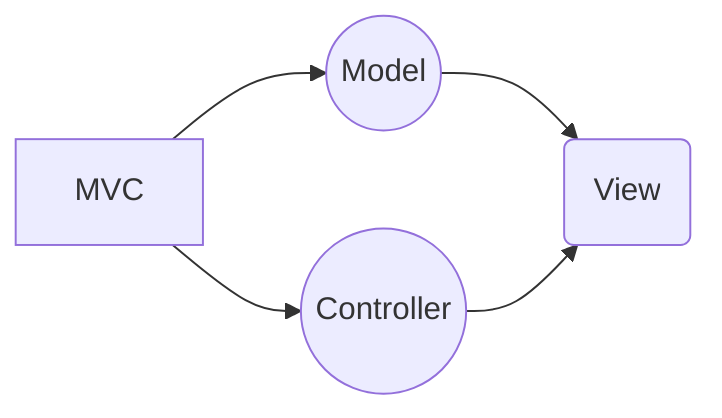

# Golang Login System
## Golang Ang Sqlite database 

## Features

- Signup
- Login
- Logout
- Forget Password

# Stack

## Backend

- HTTP Middleware [gorilla/mux](https://github.com/gorilla/mux)
- Login Session [gorilla/sessions](https://github.com/gorilla/sessions)
- Database Sqlite [go-sqlite3](https://github.com/mattn/go-sqlite3) and [msql](https://github.com/mateors/msql)

## Frontend
- Server side templating [Go Html Templates](https://pkg.go.dev/html/template)
- Frontend ```Pure Html css```
## Modules
```go
require (
	github.com/gorilla/mux v1.8.0
	github.com/gorilla/sessions v1.2.1
	github.com/mateors/msql v0.0.0-20211213034720-26a7ed4e79c4
	github.com/mattn/go-sqlite3 v1.14.11
)

require github.com/gorilla/securecookie v1.1.1 // indirect
```


